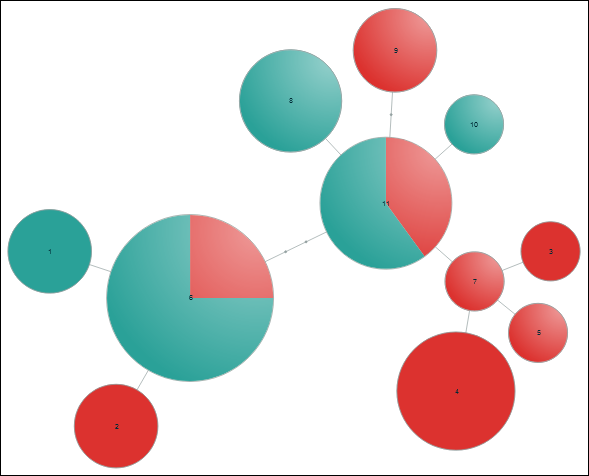

# Fitchi

Haplotype genealogies based on Fitch distances.

This is a Python package for [Fitchi](https://github.com/mmatschiner/Fitchi). For more information on the original, see [here](https://evoinformatics.group/fitchi.html).



[*Ouput example*](https://itaxotools.github.io/Fitchi/examples/example.html)

## Installation

You may install directly from the commandline using `pip`:

```
pip install git+https://github.com/iTaxoTools/Fitchi.git
```

## Usage

You may invoke Fitchi from Python using `compute_fitchi_tree()`. This returns a tree in the form of `HaploNode` objects, which can be used for downstream analysis or visualization.

The original command-line tool is also included as part of the installation. It produces HTML files from Nexus files (see the example input and ouput files [here](./examples/)). You will need *all* dependencies in order to run Fitchi this way.

See the [scripts](./scripts/) folder for some usage examples.

## Dependencies

Fitchi requires [scipy](https://pypi.org/project/scipy/).
Extra statistics require [biopython](https://pypi.org/project/biopython/).
Visualization requires [pygraphviz](https://pypi.org/project/pygraphviz/).

To install pygraphviz, please follow [these instructions](https://pygraphviz.github.io/documentation/stable/install.html) from the pygraphviz documentation.

## Citation

*Matschiner M (2015) Fitchi: Haplotype genealogy graphs based on the Fitch algorithm. Bioinformatics, 32:1250-252.*
